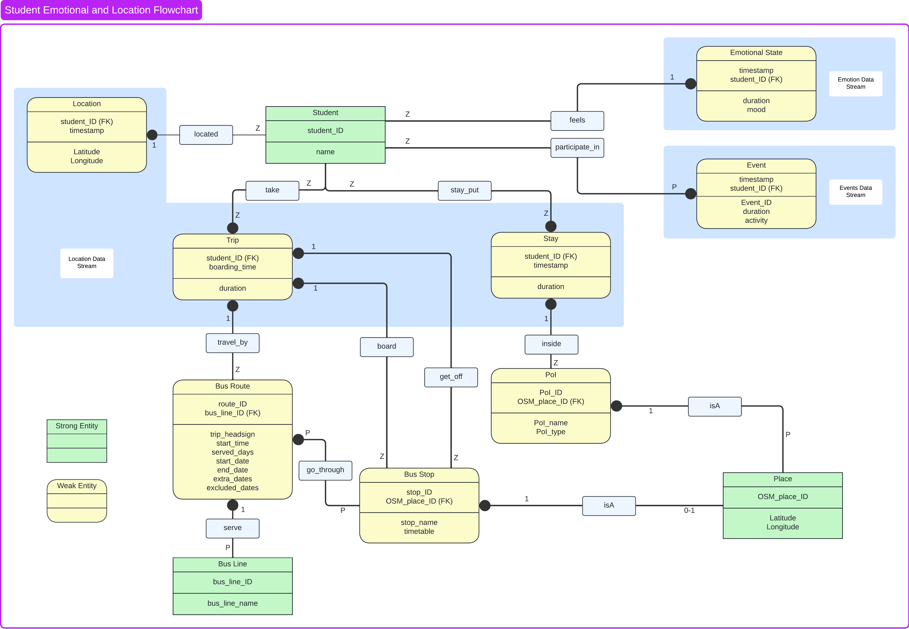

<!-- # yesunerdene9.github.io asd -->
<!-- 
 -->

<h1>KGE Student commutes</h1>

*By Davide Cavicchini & Yesun-Erdene Jargalsaikhan*

# Materials

**Project repository**

The GitHub repository can be found [here](https://github.com/yesunerdene9/KGE_student_commutes).

**Report**

The report of this project can be found [here](https://github.com/yesunerdene9/KGE_student_commutes/blob/main/Documentation/2024___2025_KGE_Project_Report_Template.pdf)

**Presentation slides**

The presentation of this project can be found [here](https://github.com/yesunerdene9/KGE_student_commutes/blob/main/Documentation/2024___2025_KGE_Project_Report_Template.pdf)

# Introduction

In this project, we developed a knowledge graph by integrating the data sources.

The objective of this project is to build a knowledge graph that assists students in planning their trips from one location to another using public transportation in an efficient and comfortable manner. This tool aims to facilitate informed decision-making and enhance students’ overall university experience. This has been achieved by integrating historical data on student commutes and activities, public transportation information, and points of interest.

## Personas, Scenarios, and Competency questions

To formalize the purpose of the project, we provided personas that covers various lifestyles among student which are useful to define diverse interactions with the knowledge graph.

    
Click here to see the personas

    
    Person 1 Alessia, a new international student, has recently started studying at the university.

    Person 2 Paolo, a second-year master’s student.

    Person 3 Houda, an Erasmus student who wants to save up money

    Person 4 Lucia, a student habit of dining in restaurants quite frequently

    Person 5 Emanuele, a student who lives in San Bartolomeo student residence

## Competency questions 

Based on 5 Personas and 5 Scenarios, we defined 13 Competency Questions in total. 

    
Click here to see the competency questions

    
    1. P1-S1. Is public transport available to reach the destination?

    2. P1-S1. How many people are currently present on the chosen bus?

    3. P1-S1. How many people are the social interaction locations in the city?

    4. P2-S2. Which facility best fits the student’s needs or has the least impact on their mood?

    5. P2-S2. How crowded is BUC?

    6. P3-S3. Which supermarket best meets the student’s needs?

    
    7. P3-S3. What was the student’s mood when they were at the Coop supermarket?

    
    8. P3-S3. What is the best route to the Coop supermarket?

    
    9. P3-S3. How did I feel about the trip to the Coop supermarket?

    
    10. P4-S4. Which restaurant served a meal that met the student’s expectations?

    
    11. P5-S5. Which sports facility is closest to the student?

    
    12. P5-S5. What is the best bus route to the sports facility?

    
    13. P5-S5. What is the closest bus stop to reach the facility?

## ER Model

# Information Gathering

## Data Resources

**SmartUnitn2**

For the purpose of the project, this dataset is used for extracting information about the student commutes and activities including emotional states.

**Trentino Trasporti**

[https://dati.trentino.it/dataset?tags=trasporto+pubblico](https://dati.trentino.it/dataset?tags=trasporto+pubblico)

**Open Street Map**

[https://www.openstreetmap.org/](https://www.openstreetmap.org/)

**Points of Interest in Trentino**

[https://dati.trentino.it/dataset/punti-di-interesse-del-trentino](https://dati.trentino.it/dataset/punti-di-interesse-del-trentino)

# Language Definition

In this phase, we formally defined the purpose-specific language resources by selecting all the concepts from the informationin the dataset and formalize them using Universal Knowledge Core (UKC) by aligning. Then we generated language resource representing the formalized concepts and their description.

# Knowledge Definition

In this phase, we produce the knowledge teleontology for the final knowledge graph by exploiting the concepts we defined in the Language definition phase.

## Knowledge Resources

Schema.org version 28.1

[https://schema.org/](https://schema.org/)

OSM teleontology
[https://datascientiafoundation.github.io/LiveKnowledge](https://datascientiafoundation.github.io/LiveKnowledge/datasets/osm-teleontology/)

GTFS

# Entity Definition

# Evaluation

# Final Knowledge Graph

# Conclusion

<!-- 
 -->