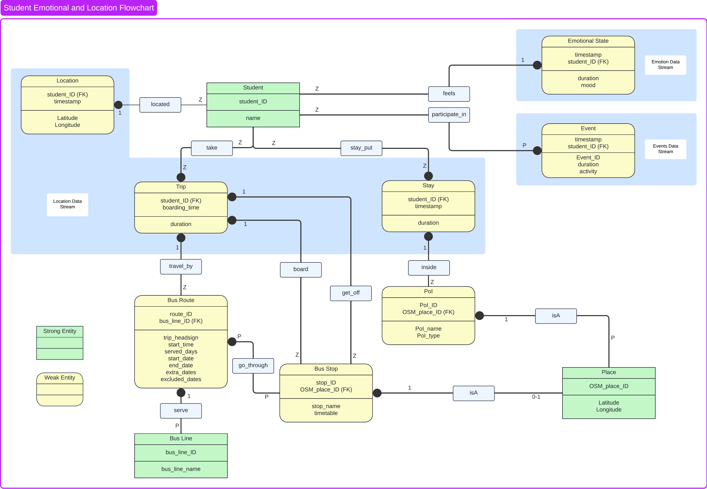
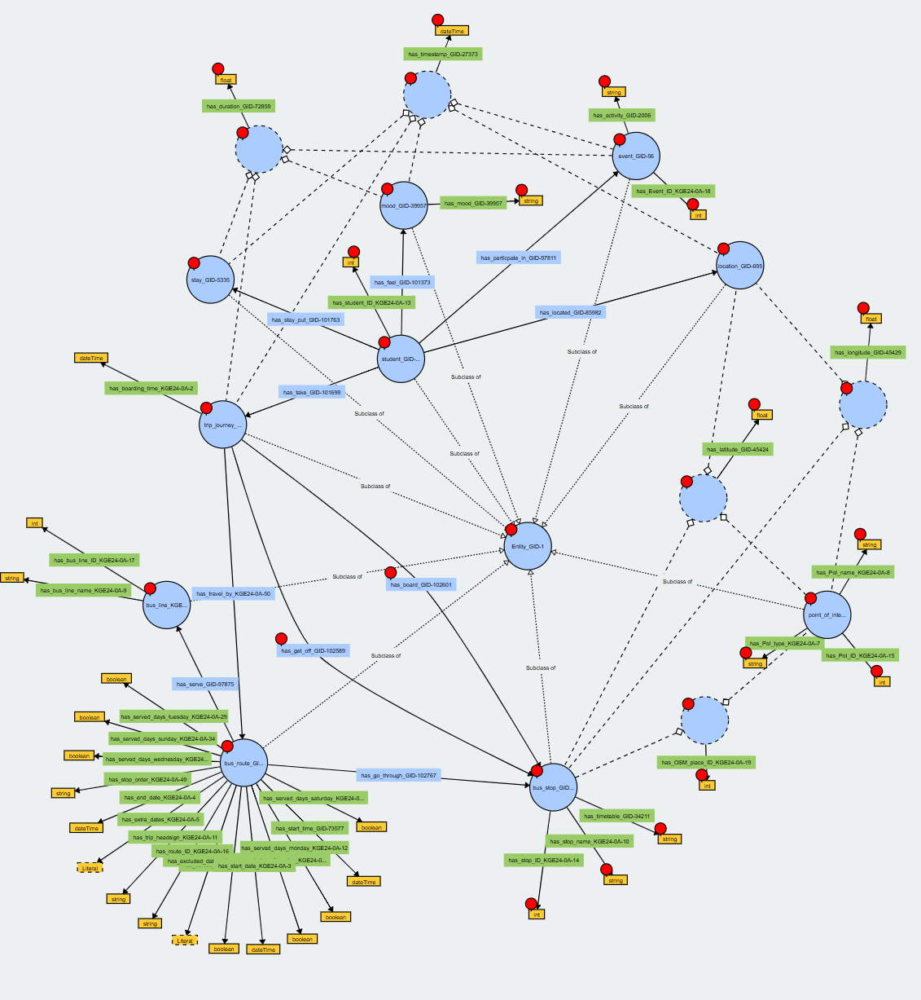
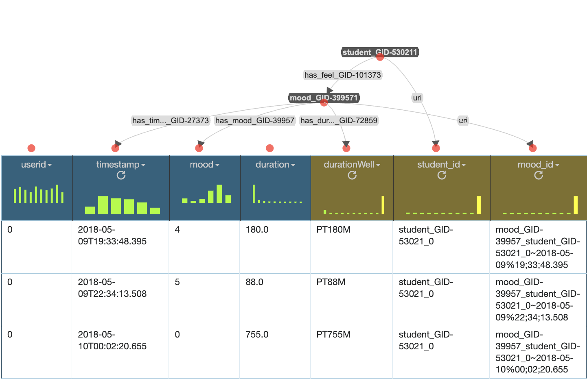
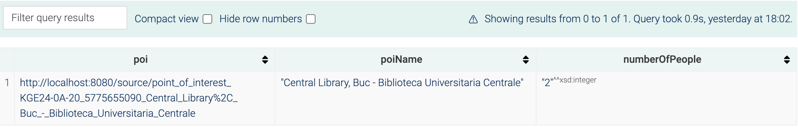
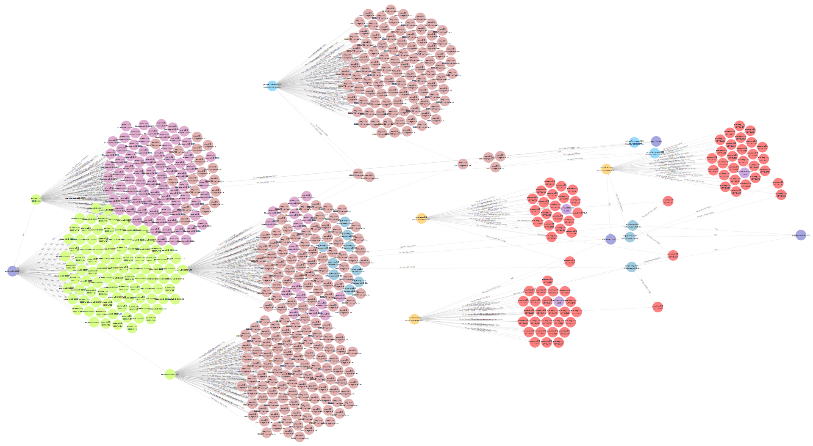

<!-- # yesunerdene9.github.io asd -->
<!-- <div style="margin-left: 10%; margin-right: 10%; "> -->
<!-- 
# KGE Student commutes

<h1>KGE Student commutes</h1> -->
<!-- <div style="width: 80%; margin-left: 19%;"> -->


*By Davide Cavicchini & Yesun-Erdene Jargalsaikhan*

# Materials

**Project repository**

The GitHub repository can be found [here](https://github.com/yesunerdene9/KGE_student_commutes).

**Report**

The report of this project can be found [here](https://github.com/yesunerdene9/KGE_student_commutes/blob/main/Documentation/KGE_2024___Project_Report.pdf)


**Presentation slides**

The presentation of this project can be found [here](https://github.com/yesunerdene9/KGE_student_commutes/blob/main/Documentation/KGE%20A0%20-%20Student%20Life%20in%20Trento%20-%20presentation.pdf)


# Introduction & Purpose defintion

In this project, we will develop a knowledge graph

The objective of this project is to build a knowledge graph that assists students in planning their trips from one location to another using public transportation in an efficient and comfortable manner. This tool aims to facilitate informed decision-making and enhance students’ overall university experience. This has been achieved by integrating historical data on student commutes and activities, public transportation information, and points of interest.


## Personas

To formalize the purpose of the project, we provided personas that covers various lifestyles among student which are useful to define diverse interactions with the knowledge graph.


>1. Person 1 Alessia, a new international student, has recently started studying at the university.

>2. Person 2 Paolo, a second-year master’s student.

>3. Person 3 Houda, an Erasmus student who wants to save up money

>4. Person 4 Lucia, a student habit of dining in restaurants quite frequently

>5. Person 5 Emanuele, a student who lives in San Bartolomeo student residence

## Scenarios
> **Social Interaction** - Alessia has recently moved to Italy and is excited to spend time with her new friends, exploring the city center of Trento, as she is eager to get to know the city.

> **University Facilities** - Paolo is a second-year master’s student at the University of Trento, currently working on his thesis. He wants to study in a quiet, uncrowded place, so he needs to choose one of the university’s facilities.

> **Daily life** - As an exchange student, Houda has started living in the city center and is planning to go grocery shopping. Since the atmosphere in supermarkets varies, he wants to choose the one that best suits his preferences.

> **Dinner Place** - Regarding her dining habits, Lucia is looking for decent places to have dinner with her flatmate. While exploring restaurants she had both good and bad experiences with plates, so she doesn’t want to choose a bad one.

> **Personal Activity** - Emanuele is a professional athlete looking to have permanent training at the nearest sports facility to his student residence. A regular commute to the facility is an important part of his daily routine, so he needs to choose the one that will save him time.

## Competency questions 

Based on 5 Personas and 5 Scenarios, we defined 13 Competency Questions in total. 

<details>
    <summary>Click here to see the competency questions</summary>
    
    1. P1-S1. Is public transport available to reach the destination?

    2. P1-S1. How many people are currently present on the chosen bus?

    3. P1-S1. How many people are the social interaction locations in the city?

    4. P2-S2. Which facility best fits the student’s needs or has the least impact on their mood?

    5. P2-S2. How crowded is BUC?


    6. P3-S3. Which supermarket best meets the student’s needs?

    7. P3-S3. What was the student’s mood when they were at the Coop supermarket?

    8. P3-S3. What is the best route to the Coop supermarket?

    9. P3-S3. How did I feel about the trip to the Coop supermarket?

    10. P4-S4. Which restaurant served a meal that met the student’s expectations?

    11. P5-S5. Which sports facility is closest to the student?

    12. P5-S5. What is the best bus route to the sports facility?

    13. P5-S5. What is the closest bus stop to reach the facility?


</details>


## ER Model




# Information Gathering

## Data Resources

**SmartUnitn2**

[https://datascientiafoundation.github.io/LivePeople/datasets/2018-SU2-Trento/](https://datascientiafoundation.github.io/LivePeople/datasets/2018-SU2-Trento/)

**Trentino Trasporti**

[https://dati.trentino.it/dataset?tags=trasporto+pubblico](https://dati.trentino.it/dataset?tags=trasporto+pubblico)


**Open Street Map**

[https://www.openstreetmap.org/](https://www.openstreetmap.org/)


**Points of Interest in Trentino**

[https://dati.trentino.it/dataset/punti-di-interesse-del-trentino](https://dati.trentino.it/dataset/punti-di-interesse-del-trentino)

# Language Definition

In this phase, we formally defined the purpose-specific language resources by selecting all the concepts from the informationin the dataset and formalize them using Universal Knowledge Core (UKC) by aligning. Then we generated language resource representing the formalized concepts and their description.

# Knowledge Definition

In this phase, we produce the knowledge teleontology for the final knowledge graph by exploiting the concepts we defined in the Language definition phase.

## Knowledge Resources

**Schema.org version 28.1**

[https://schema.org/](https://schema.org/)

**OSM teleontology**

[https://datascientiafoundation.github.io/LiveKnowledge](https://datascientiafoundation.github.io/LiveKnowledge/datasets/osm-teleontology/)

**GTFS**

[https://github.com/OpenTransport/linked-gtfs/tree/master](https://github.com/OpenTransport/linked-gtfs/tree/master)

The following is the final teleology.



# Entity Definition

In this last phase, we finally created our Knowledge graphs. For example, following is the knowledge model for the mood stream.



# Evaluation & Exploitation

The Knowledge Graph we created is able to satisfy our initial purpose as we assesed the coverage metrics also we are able to answer the competency questions.

For example, for the competency question "How crowded is BUC library?" the following query is employed.


```
PREFIX xsd: <http://www.w3.org/2001/XMLSchema#>
PREFIX e: <http://knowdive.disi.unitn.it/etype#>

SELECT ?poi ?poiName (COUNT(?userID) AS ?numberOfPeople)
WHERE{
    {
        SELECT ?poi ?poiName ?stay
        WHERE{
            # GET THE POI WE WANT
            {
                SELECT ?poi ?poiName
                WHERE{
                    BIND("Central Library, Buc - Biblioteca Universitaria Centrale" AS ?name)

                    ?poi a e:point_of_interest_KGE24-0A-20;
                         e:has_PoI_name_KGE24-0A-8 ?poiName.

                    FILTER(?poiName = ?name)
                } LIMIT 1
            }
            # GET THE STAYS WE WANT
            ?stay a e:stay_GID-5335 ;
                  e:has_inside_GID-106969 ?poi ;
                  e:has_timestamp_GID-27373 ?stayTimeStamp ;
                  e:has_duration_GID-72859 ?stayDuration.
            
            BIND("2018-05-28T13:32:26"^^xsd:dateTime AS ?currTime)
            BIND("PT1H"^^xsd:duration AS ?timeBuffer)

            FILTER(
                ?stayTimeStamp <= ?currTime
                &&
                (?stayTimeStamp+?stayDuration) >= (?currTime - ?timeBuffer)
            )
        }
    }
    
    # GET THE USER CONNECTED TO EACH STAY
    ?userID a e:student_GID-53021;
            e:has_stay_put_GID-101763 ?stay.
} 
GROUP BY ?poi ?poiName
```

In result, it shows the total number of people at a certain time in BUC library: 



# Final Knowledge Graph



# Conclusion
<!-- 
|**Information A**|**Information B**|
|:---:|:---:|
| Text1 <br/> Text2 | ![stats-one](https://github-readme-stats.vercel.app/api?... |
| Text3 <br/> Text4 | ![stats-two](https://github-readme-stats.vercel.app/api?... | -->

Overall, the resulting KG was able to answer our needs and we believe that the data we pro- duced can be effectively re-used by exploiting the time dimension to align all our data streams. It could however be improved in some areas, especially in its ability to tap into more infor- mation sources for what concerns the PoIs around Trento city. Our initial solution included the OSM place ID for each PoI so that more domain-relevant information could be pulled from other sources. Nonetheless, we still believe a more extensive knowledge modeling effort should be undertaken concerning the PoIs information. However, we did not feel that was the focus of our purpose. We preferred to focus our attention on how to use the students’ information to compute useful knowledge, which could then be queried to answer our CQ.